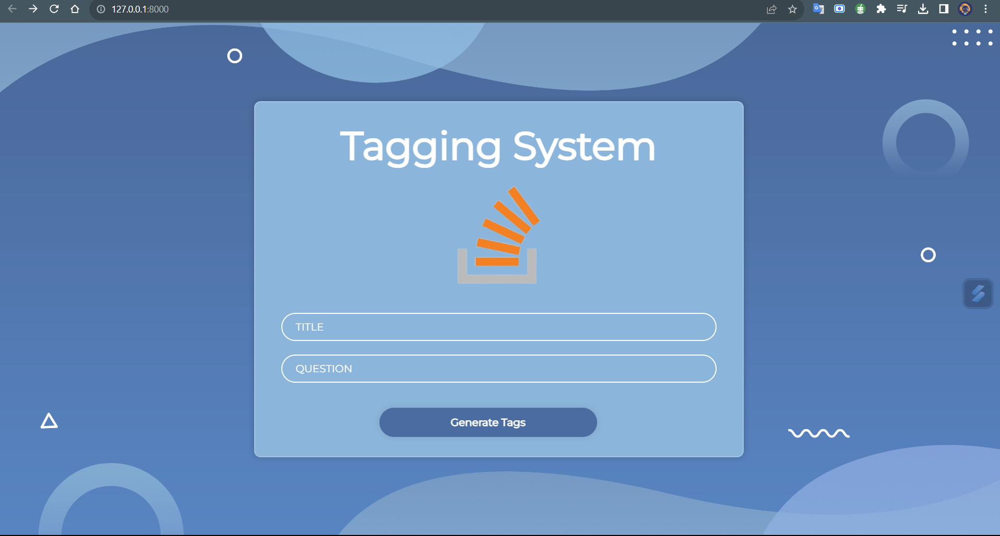
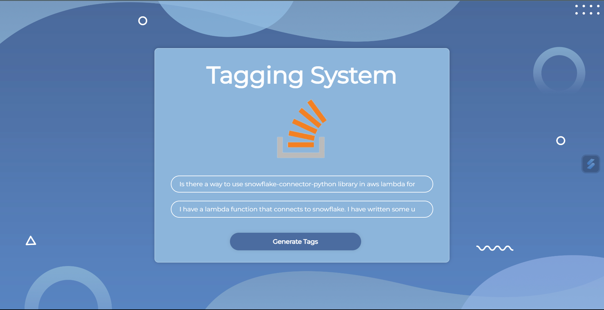
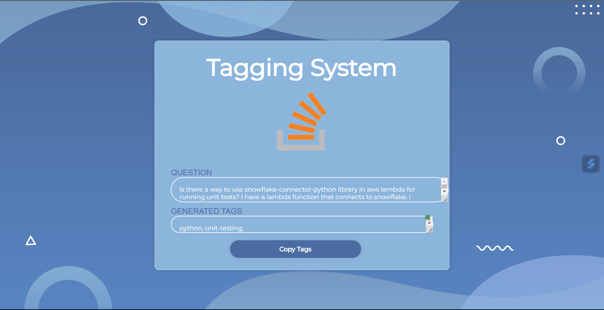
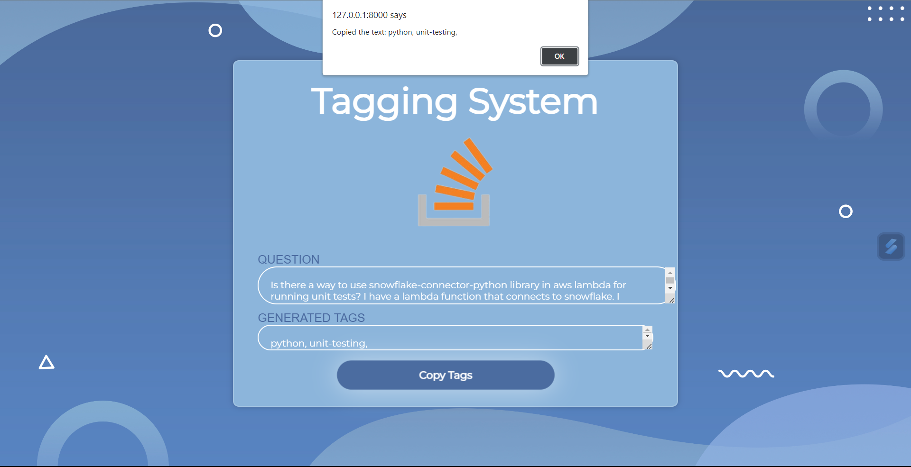
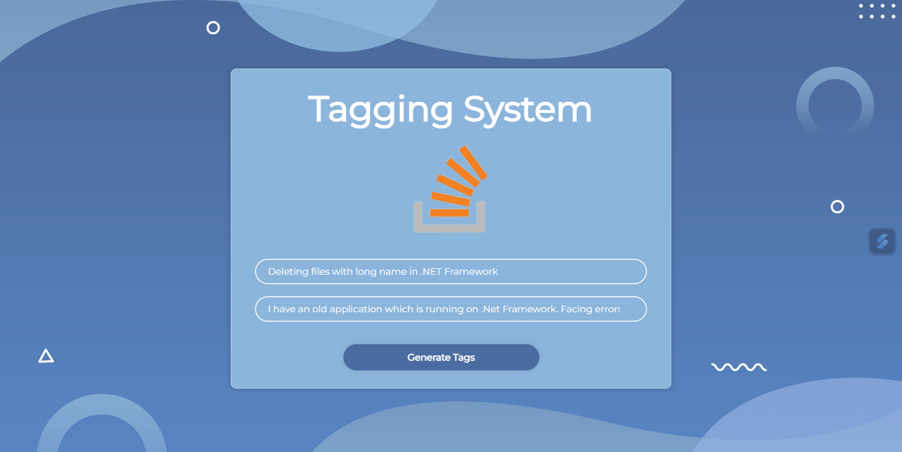

# Tagging System
The Tagging system is a web application that automatically assigns tags to stack overflow questions based on their content.
<h2> Benefits of an autonomous tagging system </h2>
- <b>Improved discoverability of questions : </b> When questions are tagged correctly, they are more likely to be found by users who are lookin for help with similar problems  <br>
- <b>Increased relevance of answers : </b> When answers are tagged with the same tags as the questions they are answering, they are more likely to be relevant and helpful <br>
- <b>Reduced workload for moderators : </b> Moderators can focus on other tasks, such as reviewing questions and answers, when an autonomous tagging system is in place<br>
<h2>Team Members and Roles</h2>
<h3>Team Name : Tag Masters </h3>
<ol>
<li> Roopa Dharshini - Teal Lead, ML Developer </li>
<li> Harish Raghavendar - Cloud Developer </li>
<li> Ujjwal Anand - Back-end Developer </li>
<li> Hritesh Sinha - Front-end Developer </li>
</ol>

<h2> Uniqueness of Tagging System </h2>
<ul>
<li> <b>Introduced Copy-to-Clipboard button</b></li>
    The copy to clipboard button is a small button that allows users to copy tags to the clipboard. This can be useful to copy tags from 'Tagging System' and include those tags while asking questions in Stack overflow website, so that the user can found solution easily
<!-- <li> <b>Published a fully functioning web-app</b></li>
    The Tagging System web-app is fully functioning and anyone can use it. This is the most important uniqueness of this app and we are planning to include more features in the future -->
</ul>
<h2> App Screenshots </h2>
<ul>
<li>Landing Page / Home Page </li>
</img><br>
<h3>Example for Python Tags</h3> 
<li> Question & Title Input Page </li>
</img><br>
<li> Tags Prediction Page </li>
</img><br>
<li> Tags Copied to Clipboard </li>
</img><br>
<h3>Example for .Net Tags</h3> 
<li> Question & Title Input Page </li>
</img><br>
<li> Tags Prediction Page </li>
</img><br>

<h2> How it Works ? </h3>
<ol>
<li>The user should provide the Title and body of the question in the landing page of the "Tagging System App" </li>
<li>The title and the body of the question will undergo vector transformation before feeding the data to the trained model </li>
<li>The App access already trained model in `model.py` as a pickle file inorder to make predictions </li>
<li>The predicted tags will be a set of numeric arrays, this then undergo inverse transformations inorder to convert it as a `string` </li>
<li>Then the predcited tags will be displayed in the web page which allows the users to copy and use it </li>
</ol>
<h3>Tech Stack Used </h3>
<ul>
<li>Model Preprocessing </li>
<ul>
<li> IBM Watson (NLP) </li>
<li> Pandas, Numpy </li>
<li> Scikit-learn </li>
</ul>
<li> Model Training </li>
<ul>
<li> Support Vector Machine Model </li>
<li> Logistic Regression Model </li>
<li> OneVsRest Classifier Model </li>
<li> TfIdVectorization </li>
</ul>
<li> Front-End </li>
<ul>
<li> Html </li>
<li> Css </li>
<li> Javascript </li>
</ul>
<li> Back-End </li>
<ul>
<li> Django </li>
<li> Python </li>
</ul>
<li> Deployment </li>
<ul>
<li> Python Anywhere </li>
</ul>
</ul>
<h3> IBM Cloud Technology </h3>
<ul>
<li> <b> IBM Watson Studio </b> </li>
    We have used IBM Watson to pre-process the Stack overflow dataset given to us. We used 'NLP module' in IBM Watson studio to remove the following :
    <ul>
    <li> To remove punctuations (,.?/\:""''*&) </li>
    <li> To remove stop words (a,an,not,..) </li>
    <li> To replace words (don't - donot, can't - cannot, ...) </li>
    <li> To drop the unwanted columns (Score, Date, Time) </li>
    <li> To check and replace the null values </li>
    </ul>
</ul>
<h2>How to access the web app ? </h2>
To access the Tagging System web app, follow the instructions below:
<ol>
<li> Ensure you have Python 3.x installed on your system </li>
    ```bash
    python --version
    ```
<li> Clone this repository </li>
    ```bash
    git clone https://github.com/Rupa-Rd/SBSPS-Challenge-9913-Autonomous-Tagging-Of-Stack-Overflow-Questions.git
    ```
<li> Find the folder A </li>
<li> Click `Generate Tags` button </li>
<li> Find the predicted tags in the next page </li>
<li> Copy the tags for further use </li>
</ol>
<h2>Confused? </h2>
If you're confused in accessing the "Tagging System" web-app. Watch this video.
<ul><li>Click here to watch </li></ul>

<br>
<h3><b><center> The app is all yours. Have fun!😊 </center></b></h3>
